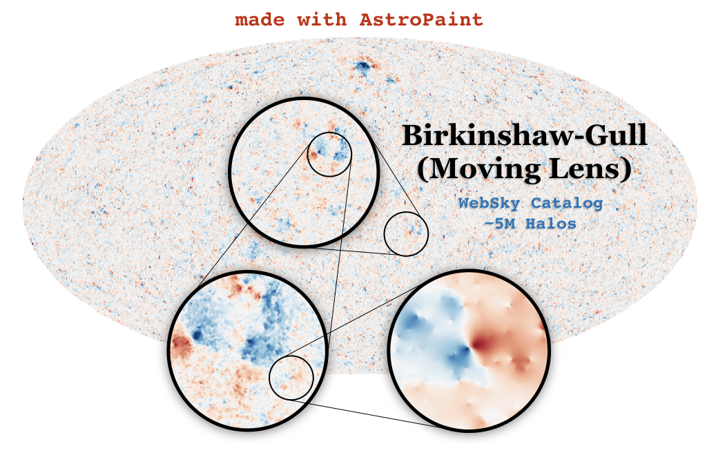
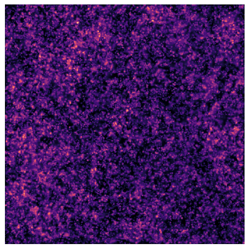
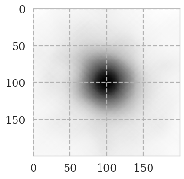
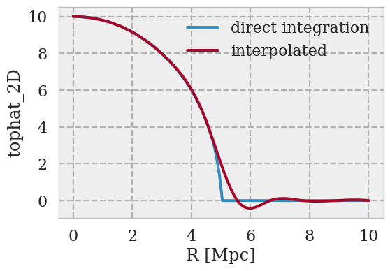
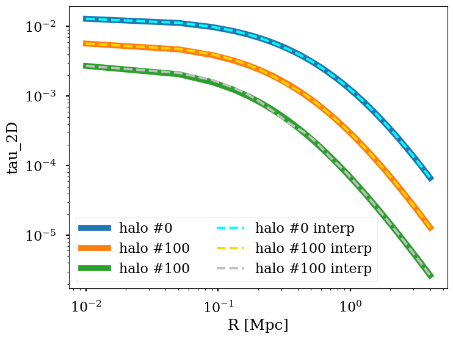
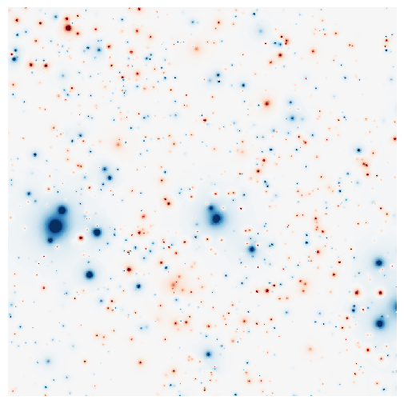

# AstroPaint
_A python package for painting the sky_ 


You can install **AstroPaint** by running the following in the command line:

`git clone https://github.com/syasini/AstroPaint.git`

`cd AstroPaint`

`pip install [-e] .` 

the `-e` argument will install the package in editable mode which is suitable for developement. If you want to modify the code use this option.


# Workflow

Converting catalogs to mock maps with AstroPaint is extremely simple. Here is what an example session looks like:

```python
from astropaint import Catalog, Canvas, Painter

catalog = Catalog(data=your_input_data)

canvas = Canvas(catalog, nside)

painter = Painter(template=your_radial_profile)

painter.spray(canvas)
```

That's it! Now you can check out your masterpiece using

`canvas.show_map()`




# Examples

## Nonsense Template

Here's an example script that paints a nonsense template on a 10 x 10 [sqr deg]
 patch of the `Sehgal` catalog: 


```python
import numpy as np
from astropaint import Catalog, Canvas, Painter

# Load the Sehgal catalog
catalog = Catalog("Sehgal")

# cutout a 10x10 sqr degree patch of the catalog
catalog.cut_lon_lat(lon_range=[0,10], lat_range=[0,10])

# pass the catalog to canvas
canvas = Canvas(catalog, nside=4096, R_times=5)

# define a nonsense template and plot it
def a_nonsense_template(R, R_200c, x, y, z):
    
    return np.exp(-(R/R_200c/3)**2)*(x+y+z)

# pass the template to the painter
painter = Painter(template=a_nonsense_template)

# plot the template for halos #0, #10, and #100 for R between 0 to 5 Mpc 
R = np.linspace(0,5,100)
painter.plot_template(R, catalog, halo_list=[0,10,100])
```


The painter automatically extracts the parameters `R_200c` and `x,y,z
` coordinates of the halo from the catalog that the canvas was initialized
 with. Let's spray ths canvas now:
 
```python
# spray the template over the canvas
painter.spray(canvas)

# show the results
canvas.show_map("cartview", lonra=[0,10], latra=[0,10])
```


_Voila!_
## Stacking
You can easily stack cutouts of the map using the following:

```python
deg_range = [-0.2, 0.2] # deg
halo_list = np.arange(5000) # stack the first 5000 halos

# stack the halos and save the results in canvas.stack
stack = canvas.stack_cutouts(halo_list=halo_list, lon_range=deg_range, lat_range=deg_range)

plt.imshow(canvas.stack)
```


 
 If this is taking too long, use `with_ray=True` for *parallel stacking*. 

## Line-Of-Sight integration of 3D profiles

AstroPaint only allows you to paint 2D (line-of-sight integrated) profiles on
 your catalog halos, so if you already have the analytical expression of
  the projected profile you want to paint, we are in business. However, not
   all 3D profiles can be LOS integrated analytically (e.g. generalized NFW
    or Einasto, etc), and integrating profiles numerically along every
     single LOS is generally expensive. In order to alleviate this problem, AstroPaint offers two python decorators
 `@LOS_integrate` and `@interpolate` which make 3D -> 2D projections effortless.
 
 To convert a 3D profile into a 2D LOS integrated profile, all you need to do
  is add the `@LOS_integrate` to the definition.
  
 For example, here's how you can turn a 3D top hat profile 
 
 ```python
def tophat_3D(r, R_200c):
    """Equals 1 inside R_200c and 0 outside"""
    
    tophat = np.ones_like(r)
    tophat[r > R_200c]=0 
    
    return tophat
```

into a 2D projected one:

```python  
from astropaint.lib.utilities import LOS_integrate

@LOS_integrate
def tophat_2D(R, R_200c):
    """project tophat_3D along the line of sight"""

    return tophat_3D(R, R_200c)
``` 
This function integrates the `tophat_3D` function along every single line of
 sight. If you have many halos in a high resolution map, this can take
  forever. The trick to make this faster would be to integrate along a
   several LOSs and interpolate the values in between. This is what the
    `@interpolate` decorator does. So, a faster version of the `tophat_2D
    ` function can be constructed as the following:
    

```python  
from astropaint.lib.utilities import interpolate

@interpolate(n_samples=20)
@LOS_integrate
def tophat_2D_interp(R, R_200c):
    """project and interpolate tophat_3D along the line of sight"""
 
    return tophat_3D(R, R_200c)
```   
This is much faster, but the speed comes at a small price. If your 3D profile
 is not smooth, the interpolated 2D projection will slightly deviate from the
  exact integration.  
  
 

You can minimize this deviation by increasing the `n_samples` argument of the
 `@interpolate` decorator, but that will obviously decrease the painting speed.
 
 Does this plot agree with what you would expect a LOS integrated top hat
  profile (a.k.a. a solid sphere) to look like? 

## Painting Optical Depth and kSZ Profiles on the WebSky Catalog  

Let's use the `Battaglia16` gas profiles to paint tau (optical depth) and
 kinetic Sunyaev-Zeldovich (kSZ) on the WebSky catalog halos. 
 
 ```python
from astropaint.profiles import Battaglia16
 
 tau_painter = Painter(Battaglia16.tau_2D_interp)
```
 
 Since the shape of the profile is smooth, we won't lose accuracy by using the
  interpolator. 
  
  
  

Let's paint this on a 5x5 sqr deg patch of the WebSky catalog with a mass
 cut of 8E13 M_sun. 
 
 ```python
catalog = Catalog("websky_lite_redshift")
catalog.cut_lon_lat(lon_range=[5,10], lat_range=[5,10])
catalog.cut_M_200c(8E13)

canvas = Canvas(catalog, nside=8192, R_times=3)

tau_painter.spray(canvas)
``` 


The `Battaglia16.kSZ_T` function uses this tau and multiplies it by the
 dimensionless velocity of the halos to get the kSZ signal. 
 
```python 
kSZ_painter = Painter(Battaglia16.kSZ_T)
kSZ_painter.spray(canvas)
```
And here is what it looks like:




# How to contribute

If you would like to contribute to AstroPaint, take the following steps:

1) Fork this repository
2) Clone it on your local machine
3) Create a new branch (be as explicit as possible with the branch name)
4) Add and Commit your changes to the local branch
5) Push the branch to your forked repository
6) Submit a pull request on this repository

See [this repository](https://github.com/firstcontributions/first-contributions) for more detailed instructions. 

Developement happens on the `develop` branch, so make sure you are always in sync with the latest version and submit your pull requests to this branch. 

